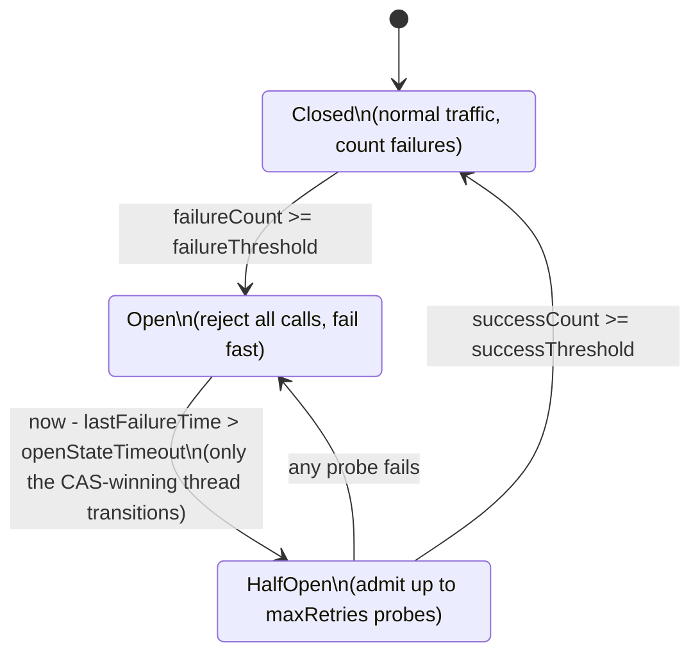
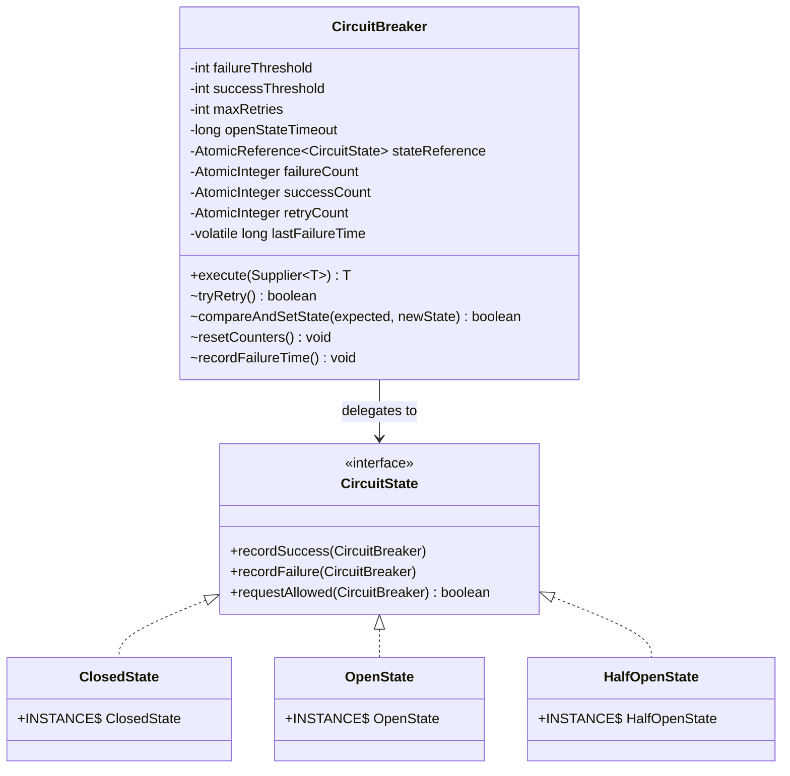
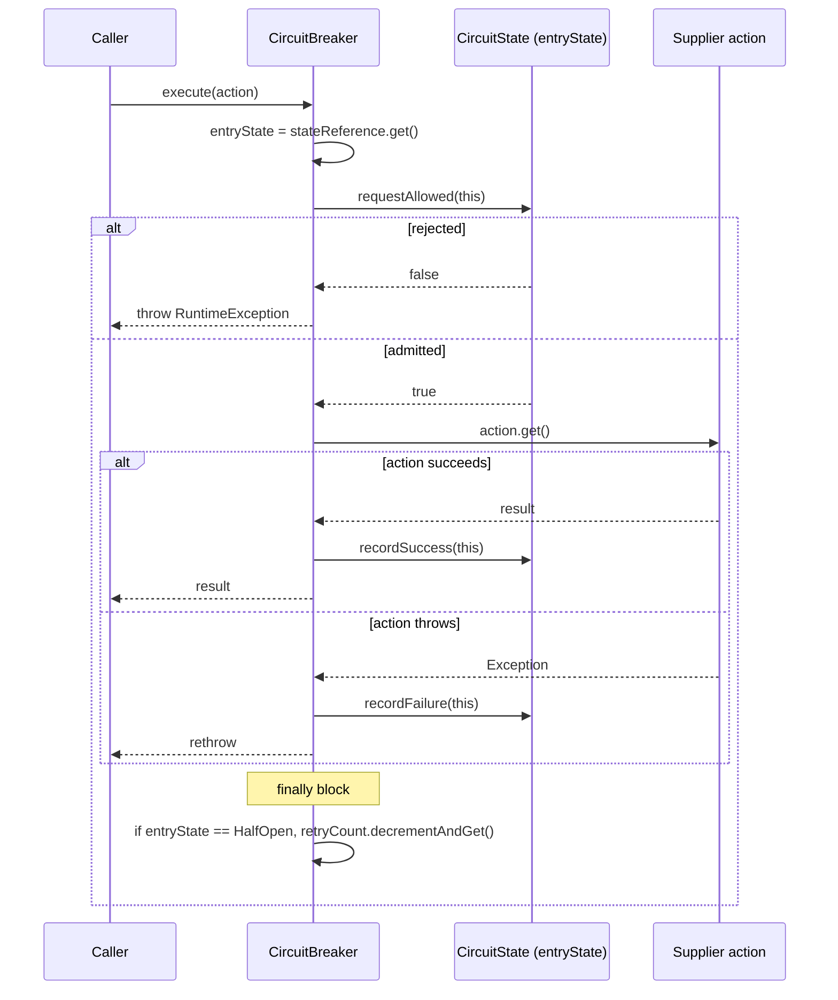
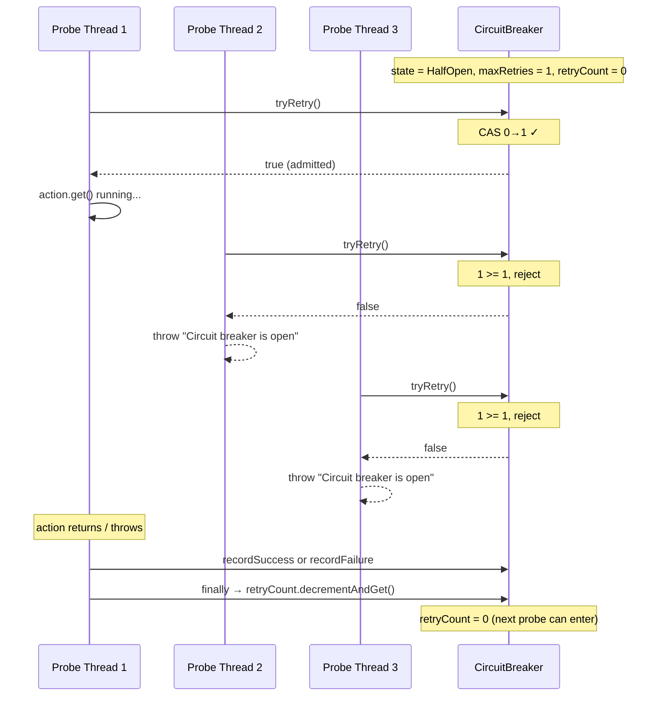

# Circuit Breaker

A thread-safe, lock-free Circuit Breaker implementation in Java built with the **State design pattern** and `java.util.concurrent.atomic` primitives. Wraps any `Supplier<T>` and protects callers from a failing downstream by failing fast once a failure threshold is crossed, then carefully probing for recovery before letting normal traffic flow again.

---

## What is a Circuit Breaker?

A circuit breaker sits between your code and a remote dependency (HTTP API, database, message queue, etc.). When the dependency starts failing, the breaker "trips" and short-circuits subsequent calls — returning an error immediately instead of piling more load onto a struggling service. After a cool-down period, it admits a small number of probe calls. If those succeed, normal traffic resumes; if they fail, the breaker re-opens.

This prevents the most common cascading-failure pattern in distributed systems: a slow downstream causes upstream threads to block on it, exhausting thread pools, which makes the upstream slow, which propagates to *its* upstream, and so on.

---

## Public API

```java
CircuitBreaker breaker = new CircuitBreaker(
    /* failureThreshold  */ 5,      // failures in Closed before tripping
    /* successThreshold  */ 3,      // successes in HalfOpen before closing
    /* openStateTimeout  */ 10_000, // ms to wait in Open before probing
    /* maxRetries        */ 1       // concurrent probes allowed in HalfOpen
);

String result = breaker.execute(() -> httpClient.call("/api/foo"));
```

If the breaker is open or fully booked on probes, `execute` throws a `RuntimeException("Circuit breaker is open. Request not allowed.")`.

---

## State Machine



| State | Behavior on `execute` | Transition trigger |
|---|---|---|
| **Closed** | All calls pass through. Failures increment `failureCount`; one success resets it. | `failureCount >= failureThreshold` → Open |
| **Open** | All calls rejected immediately. After `openStateTimeout` ms, the next caller becomes the probe. | One thread wins CAS to → HalfOpen |
| **HalfOpen** | At most `maxRetries` concurrent probes admitted via atomic CAS-loop. Excess calls rejected. | `successThreshold` cumulative successes → Closed; any failure → Open |

---

## Class Diagram



The three state classes are **stateless singleton flyweights** — one instance per JVM, shared across all `CircuitBreaker` instances. All mutable runtime state lives on the `CircuitBreaker` "context."

---

## Execution Flow



Note the key invariant: **`entryState` is captured once and reused throughout the call.** This prevents the "torn state machine" race where `requestAllowed`, `recordSuccess`, and `recordFailure` could otherwise see different states.

---

## Concurrency Model

| Field | Mechanism | Why |
|---|---|---|
| `stateReference` | `AtomicReference<CircuitState>` + CAS | Lock-free state transitions; only one thread wins each transition |
| `failureCount`, `successCount` | `AtomicInteger` | Multiple threads can record outcomes without locks |
| `retryCount` | `AtomicInteger` + custom CAS-loop in `tryRetry()` | Atomic check-and-claim of probe permits |
| `lastFailureTime` | `volatile long` | Single-writer / many-reader visibility |

### The two critical races and how we handle them

**1. Herd at recovery (Open → HalfOpen)**

When `openStateTimeout` elapses, all in-flight callers find `(now - lastFailureTime) > timeout`. Without protection, every one of them would simultaneously hit the recovering downstream and re-break it.

**Solution:** Only the thread that wins `compareAndSetState(Open, HalfOpen)` is admitted; the others fall through to `return false`.

```java
// OpenState.requestAllowed
if (now - lastFailureTime > openStateTimeout) {
  if (compareAndSetState(this, HalfOpenState.INSTANCE)) {
    resetCounters();
    return tryRetry();   // winner takes a probe permit
  }
}
return false;
```

**2. Concurrent probes during HalfOpen**

While the first probe is in flight, additional callers arrive and see `state = HalfOpen`. Without a cap, they'd all flood the recovering downstream.

**Solution:** Atomic check-and-claim via CAS-loop on `retryCount`. At most `maxRetries` permits exist; release happens in the `finally` block of `execute`.

```java
// CircuitBreaker.tryRetry
while (true) {
  int cur = retryCount.get();
  if (cur >= maxRetries) return false;       // check
  if (retryCount.compareAndSet(cur, cur + 1)) return true;  // claim
  // CAS failed → another thread changed it; loop
}
```

The acquire/release pair is the same pattern as `Lock.lock()` / `unlock()` — the permit is held for the duration of `action.get()` regardless of outcome.

---

## Probe Permit Lifecycle (HalfOpen)



---

## Configuration Guidance

| Parameter | Typical Range | Trade-off |
|---|---|---|
| `failureThreshold` | 5–20 | Lower = more sensitive (trips on transient blips); higher = slower to react to real outages |
| `successThreshold` | 3–10 | Lower = quick recovery declaration; higher = more confidence the downstream is truly healthy |
| `openStateTimeout` | 5s–60s | Shorter = faster recovery attempts (riskier if the downstream needs time); longer = more breathing room for the downstream |
| `maxRetries` | **1** | Conservative — single-probe recovery. Raise only if the downstream can absorb concurrent probes during recovery |

**Constraint:** `maxRetries <= successThreshold`. Otherwise you can hold more permits than you'll ever count toward closing.

---

## File Layout

```
CircuitBreaker/
└── src/
    ├── Main.java                            # entrypoint (currently empty stub)
    └── com/circuitbreaker/
        ├── CircuitBreaker.java              # context — holds atomics, dispatches to state
        ├── CircuitState.java                # interface (recordSuccess/Failure/requestAllowed)
        ├── ClosedState.java                 # singleton flyweight: normal traffic
        ├── OpenState.java                   # singleton flyweight: fail-fast + timeout probe
        └── HalfOpenState.java               # singleton flyweight: bounded recovery probes
```

---

## Design Decisions

### Why the State pattern?
Each state has different rules for `requestAllowed`, `recordSuccess`, and `recordFailure`. A switch statement on an enum would conflate three concerns; the State pattern lets each state class own its own behavior cleanly.

### Why singleton flyweights?
States are pure behavior — they hold no per-breaker state. One `ClosedState.INSTANCE` shared across all breakers is allocation-free and naturally thread-safe (immutable). All runtime state (counters, timestamps) lives on the `CircuitBreaker` context.

### Why CAS instead of `synchronized`?
The hot path is the gate check on `execute`. With a lock, every concurrent caller serializes on the breaker — which defeats the purpose of having one. CAS-based state transitions and counter updates let thousands of callers proceed in parallel; only the rare contention case (state transition, permit claim) does a CAS retry.

### Why capture `entryState` once?
Reading `stateReference.get()` multiple times in `execute` lets the state change between reads — the gate check could run against `Closed` while `recordSuccess` runs against `Open`. Capturing once and reusing the reference makes the behavior of a single call deterministic.

---

## Known Limitations

This implementation is intentionally minimal — a learning project. Production circuit breakers (Hystrix, Resilience4j, Polly) add:

- **Sliding-window failure counting** instead of consecutive-failure streaks (a single success here forgives all prior failures).
- **Slow-call detection** — calls that are slow but technically successful still saturate thread pools.
- **Exception predicates** — distinguish `IOException` (count as failure) from `IllegalArgumentException` (caller bug, don't count).
- **Typed `CircuitBreakerOpenException`** so callers can match on it.
- **State-transition listeners** for metrics and alerting.
- **Async / `CompletableFuture` overloads.**
- **Manual override** (`forceOpen`, `reset`) for incident response.

---

## Build & Run

This is a plain Java project (no Gradle/Maven) configured as an IntelliJ IDEA module.

```bash
# from project root
javac -d out src/com/circuitbreaker/*.java src/Main.java
java -cp out Main
```

Or open `CircuitBreaker.iml` in IntelliJ and run `Main`.
