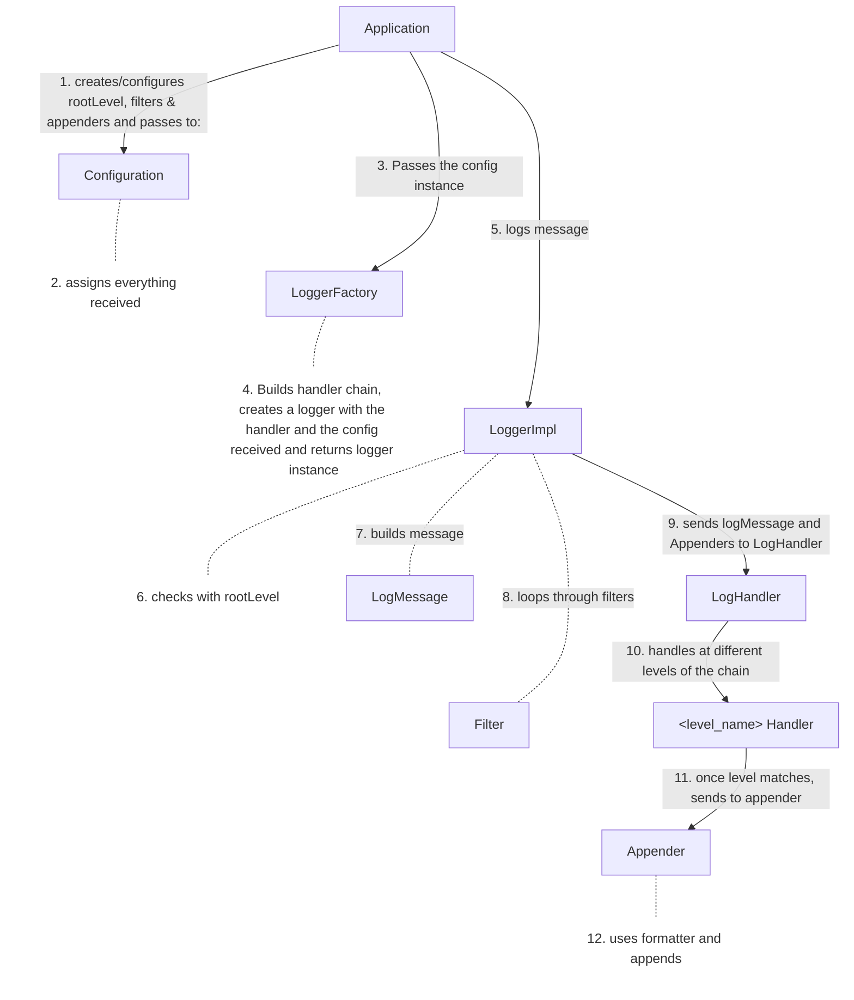
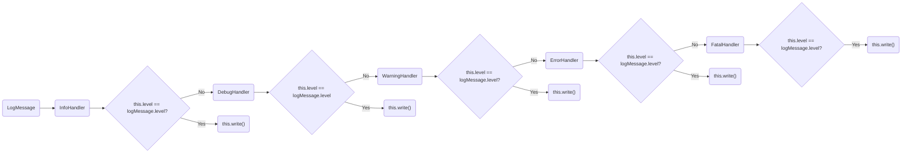
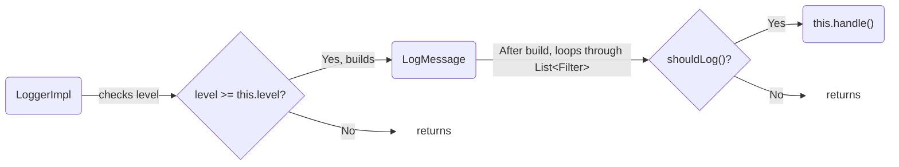
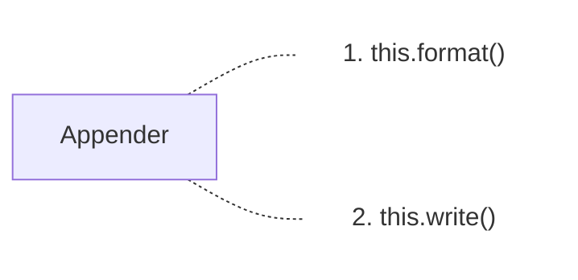

## Step 1: Clarify Requirements

### Functional Requirements
1. Log levels with priority
    - Support 5 log levels: <b>DEBUG</b>, <b>INFO</b>, <b>WARNING</b>, <b>ERROR</b>, <b>FATAL</b>
    - Each level has priority. (DEBUG = 1, INFO = 2, WARNING = 3, ERROR = 4, FATAL = 5)
    - Only log messages with priority >= configured level

2. Log has a structure.  
    Each log contains:
    - Timestamp
    - Priority/log level
    - Source
    - Message

3. Multiple output destinations:
    - Console (logs in console)
    - File (saves in file)
    - Database (saves to db)  
    Same log can go to multiple destinations

4. Configuration system:
    - Set logging level for entire system
    - Select the output destination(s) to be used (Appenders[])
    - Select how the logs get filtered (Filters[])
    - Builds the handler chain

5. Thread Safety:
    - Should not corrupt the file while simultaneously saving

6. Formatting:
    - Customize how log message appear in the output
    - Different format for different destinations

7. Extensible:
    - Should be able to add more levels
    - Easy to add more output destinations
    - Easy to add custom formatting

### Edge Cases
1. Multiple threads logging simultaneously
2. Db failure during logging
3. File full during logging

## Step 2: Identify core entities

| Entity        | Attributes / Responsibilities                  |
| -             | -                                              |
| LogLevel      | enum, priority, isGraterOrEqual(logLevel)      |
| LogMessage    | message, timestamp, minLevel, source           |
| Appender      | formatters[], Implemented by Console, File, Db |
| Logger        | rootLevel, appenders[], filters[]              |
| Configurator  | rootLevel, appenders[]                         |
| Filter        | Implemented by types of filter                 |
| Formatter     | Implemented by types of formatters             |

## Step 3: Visual Flows

1. Basic logging flow

## Step 4: Define class structure and relationships

### Core Interfaces

1. Logger
    - log(String message, LogLevel level)
 
- To avoid too many constructors, builder can be used.

2. LogAppender
    - Formatter formatter;
    - append()
    - isEnabled()
    - setFormatter()
    - getFormatter()

3. LogFilter
    - boolean shouldLog(LogMessage message)

4. LogFormatter
    - format()

### Implementations

| Interface     | Implemented By                      |
| -             | -                                   |
| Logger        | LoggerImpl                          |
| Appender      | ConsoleAppender & DbAppender        |
| Formatter     | SimpleFormatter & DetailedFormatter |
| Filter        | LevelFilter & SourceFilter          |

### Abstract Classes

1. LogHandler
    - protected LogHandler next
    - protected final LogLevel handlerLevel
    - LogHandler(LogLevel level)
    - setNext(LogHandler next)
    - handle(LogMessage message, List<Appender> appenders)
    - write(LogMessage message, List<Appender> appenders)

### Core classes

| Name              | Type  |
| -                 | -     |
| Configuration     | Class |
| LogLevel          | Enum  |
| LogMessage        | Class |
| InfoHandler       | Class |
| DebugHandler      | Class |
| WarningHandler    | Class |
| InfoHandler       | Class |
| ErrorHandler      | Class |
| FatalHandler      | Class |
| LoggerFactory     | Class |

## Step 5: Core use cases

### Configuration

    Application creates configuration and sets rootLevel, appenders and filters either by setters or builder.

### LogHandler

    Application will use LoggerFactory to create an instance of LoggerImpl by passing the configuration and then building within the factory the chain of handlers.

### LoggerImpl
    LoggerImpl will have LogMessage, List<Appender>, List<Filter>, LogHandler headHandler

1. Application creates a new LoggerImpl using LoggerFactory, by passing the configuration to LoggerFactory.createLogger() and then inside, it builds also the chain and then finally creates and returns an instance of LoggerImpl

2. Application then invokes log(message, logLevel) method of LoggerImpl

3. LoggerImpl checks if this.level is less than or equal to the logLevel passed

4. LoggerImpl builds a LogMessage, filters the message according to the filters, and if the logMessage is not filtered out,  passes the message as well as the list of appenders to the headHandler.

### Multi-threaded use case

1. Use synchronized keyword on append() method of Appender so that only one thread can append at a time.

2. If the appenders/filters can be added/removed at runtime by multiple threads, use CopyOnWriteArrayList for appenders and filters which comes from the concurrent library. It is completely thread safe.

### Filter use case

### Formatting use case
    
    
    Appender has LogFormatter inside with a composition relationship.

