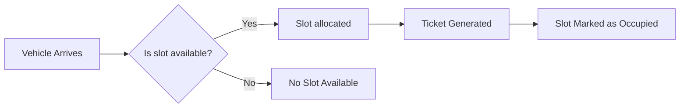
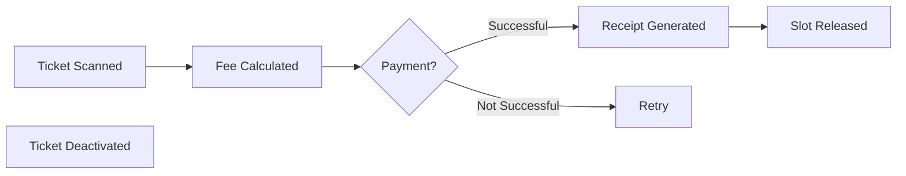
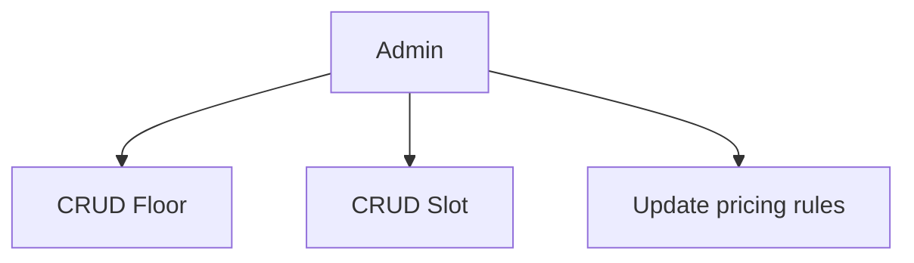
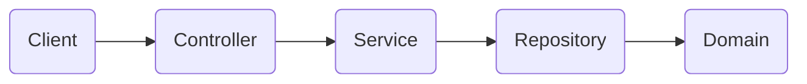
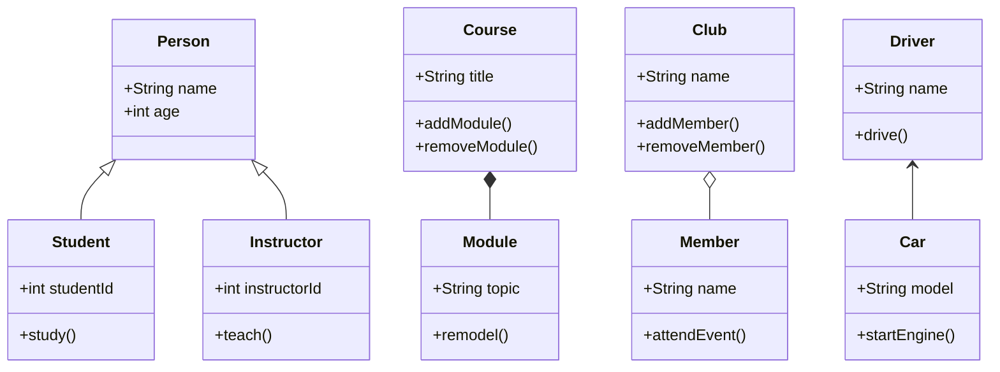

## Getting Started

Welcome to the VS Code Java world. Here is a guideline to help you get started to write Java code in Visual Studio Code.

## Folder Structure

The workspace contains two folders by default, where:

- `src`: the folder to maintain sources
- `lib`: the folder to maintain dependencies

Meanwhile, the compiled output files will be generated in the `bin` folder by default.

> If you want to customize the folder structure, open `.vscode/settings.json` and update the related settings there.

## Step 1: Requirements
### Functional requirements:
1. Entry Flow:
    - Vehicle arrives at gate
    - Assign a slot
    - Generate Ticket
    - Mark slot as occupied
    - Return entry response

2. Exit Flow:
    - Vehicle presents the ticket
    - Calculate the price according to the rules
    - Process Payment
    - Release slot
    - Return exit response

3. Admin Flow:
    - CRUD floors and tickets
    - Define/Update pricing rules
    - View Parking lot status

### Edge Cases:
1. Payment Failure at exit
2. Fake Ticket
3. Slot marked occupied incorrectly

## Step 2: Identify Core Entities
| Entity                | Attributes                    
| -                     | -                             
| Vehicle               | id, licensePlate, vehicleType
| Ticket                | id, vehicleId, slotId, entryTime, isActive
| Slot           | id, slotType, vehicleId, isOccupied, floorNumber
| Receipt               | id, amount, ticketId, exitTime, paymentStatus
| Floor                 | id, floorNumber, slots
| PricingRule           | vehicleType, ratePerHour, flatRate, ruleType
| Entry/Exit Result     | success, data, message
| Payment               | ticketId, status, gateway, amount

## Step 3: Visual Flows

1. Entry Flow Diagram

---
 

2. Exit Flow Diagram

---
 

3. Admin Flow

---
 

## Step 4: Define Class Structure & Relationships

---

### Controllers
- <b>ParkingLotController:</b> Endpoints for EnterVehicle, ExitVehicle
- <b>AdminController:</b> Endpoints for AddFloor, AddSlot, UpdatePricing

---

### Services
- <b>TicketService:</b> Generates, validates, deactivates, retrieves tickets
- <b>SlotService:</b> Allocates and releases parking slots
- <b>PricingService:</b> Calculates parking fee based on duration and type
- <b>PaymentService:</b> Processes payment
- <b>ReceiptService:</b> Generates receipt after payment
- <b>AdminService:</b> Handles admin related tasks

---

### Repositories
<b>TicketRepository, SlotRepository, FloorRepository, PaymentRepository, PricingRepository</b>
 
All these allow CRUD operations separated from service layer.

---

## Step 5: Implement Core Use Cases

### Entry Use Case: 
<b> entryEndpoint -> SlotService.allocateSlot(), TicketService.generateTicket(), TicketRepository.save(), Return EntryResult</b>

### Exit Use Case:
<b> exitEndpoint -> TicketService.retrieveAndDeactivateTicket(), PricingService.calculateFee(), PaymentService.processPayment(), ReceiptService.generateReceipt(), SlotService.releaseSlot(), Return ExitResult </b>

---

## Step 6: Apply OOP Principles & Design Patterns

### Design Patterns Used:
- <b> Adapter Pattern </b> Abstraction of payment gateways
- <b> Repository Pattern </b> Isolation of database operations
- <b> Service Layer Pattern </b> Centralization of business logic
- <b> Factory Method Pattern </b> can be used for the creation of vehicles
- <b> Strategy Pattern </b> can be used to select the pricing strategy

### OOP Principles Applied:
- <b> SRP (Single Responsibility Principle) </b> Each class has one clear responsibility
- <b> ISP (Interface Seggregation Principle) </b> Role-specific interfaces (e.g. for payment, vehicle)
- <b> DIP (Dependency Inversion Principle) </b> Services depend on interface, not concrete implementations
- <b> OCP (Open/Closed Principle) </b> System is open for extension but closed for modification
- <b> Encapsulation </b> Entities, services and repositories encapsulate both data and behaviour

---
        

