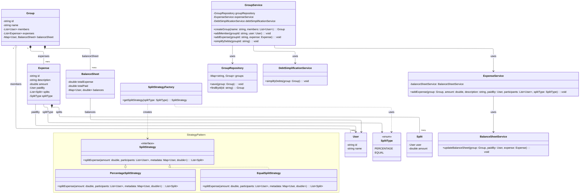

```mermaid
%%{init: {"layout": "elk"}}%%
classDiagram
    direction TD
    
    class Group {
        -string id
        -string name
        -List~User~ members
        -List~Expense~ expenses
        -Map~User, BalanceSheet~ balanceSheet
    }
    
    class User {
        -string id
        -string name
    }
    
    class Expense {
        -string id
        -string description
        -double amount
        -User paidBy
        -List~Split~ splits
        -SplitType splitType
    }
    
    class BalanceSheet {
        -double totalExpense
        -double totalPaid
        -Map~User, double~ balances
    }
    
    class SplitType {
        <<enum>>
        PERCENTAGE
        EQUAL
    }
    
    class Split {
        -User user
        -double amount
    }
    
    namespace StrategyPattern {
        class SplitStrategy {
            <<interface>>
        +splitExpense(amount: double, participants: List~User~, metadata: Map~User, double~): List~Split~
        }
    
        class PercentageSplitStrategy {
            +splitExpense(amount: double, participants: List~User~, metadata: Map~User, double~): List~Split~
        }
        
        class EqualSplitStrategy {
            +splitExpense(amount: double, participants: List~User~, metadata: Map~User, double~): List~Split~
        }
    }
    
    class SplitStrategyFactory {
        +getSplitStrategy(splitType: SplitType): SplitStrategy
    }
    
    SplitStrategy <|.. PercentageSplitStrategy
    SplitStrategy <|.. EqualSplitStrategy
    SplitStrategyFactory ..> SplitStrategy : creates
    
    class GroupRepository {
        -Map~string, Group~ groups
        +save(group: Group): void
        +findById(id: string): Group
    }
    
    class GroupService {
        -GroupRepository groupRepository
        -ExpenseService expenseService
        -DebtSimplificationService debtSimplificationService
        +createGroup(name: string, members: List~User~): Group
        +addMember(groupId: string, user: User): void
        +addExpense(groupId: string, expense: Expense): void
        +simplifyDebts(groupId: string): void
    }
    
    class DebtSimplificationService {
        +simplifyDebts(group: Group): void
    }
    
    class ExpenseService {
        -balanceSheetService: BalanceSheetService
        +addExpense(group: Group, amount: double, description: string, paidBy: User, participants: List~User~, splitType: SplitType): void
    }
    
    class BalanceSheetService {
        +updateBalanceSheet(group: Group, paidBy: User, expense: Expense): void
    }
    
    ExpenseService --> BalanceSheetService : uses
    GroupService --> ExpenseService : uses
    GroupService --> DebtSimplificationService : uses
    GroupService --> GroupRepository : uses
    Group "1" o-- "many" User : members
    Group "1" *-- "many" Expense : expenses
    Group "1" *-- "many" BalanceSheet : balanceSheet
    Expense --> User : paidBy
    Expense "1" *-- "many" Split : splits
    BalanceSheet --> User : balances
    SplitStrategyFactory ..> SplitType : uses
    Expense --> SplitType : splitType
    
```